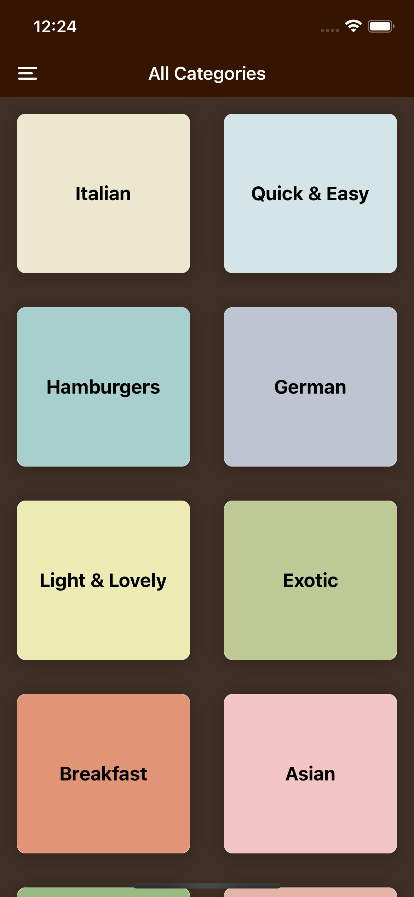
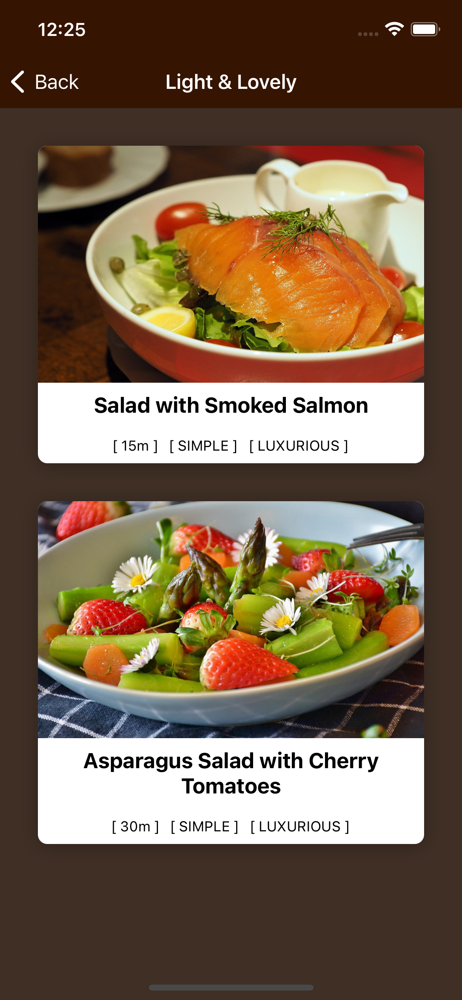
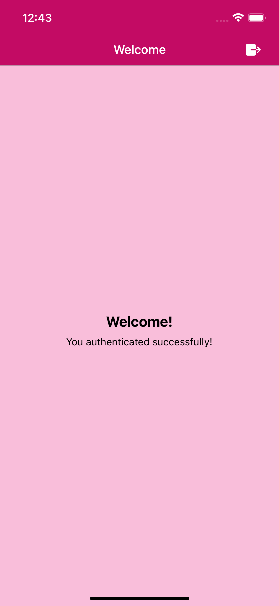
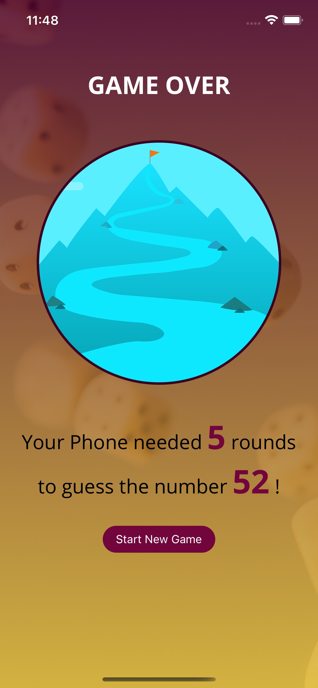
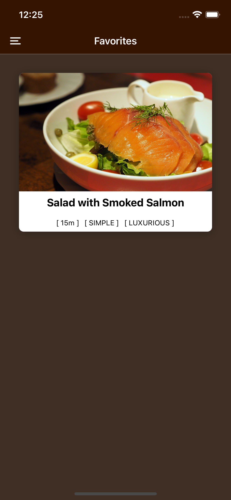

# Cook Meal Recipes

## What is this project?

- This is a mobile app that users can find different meal recipes
- Users can choose different categories of meals based on their interest
- Users can also "favorite" the meals they enjoy and check in the "favorite section"

## How to Run this project?

- Download the project folder and run `npm install` to install all the packages
- Open your mobile device simulators: Android Studio and Xcode both work
- Run `npm start` to start the `expo` with your simulator

